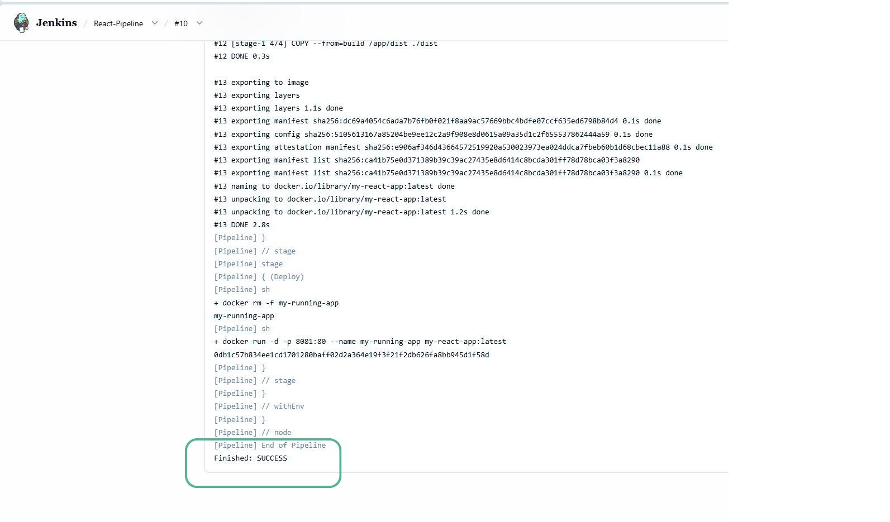
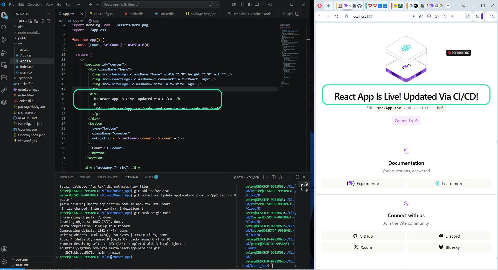
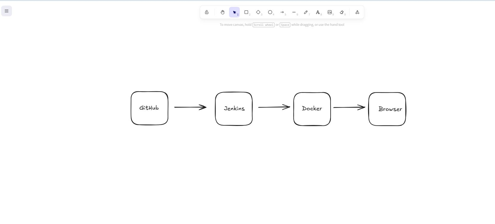

# Automated CI/CD Pipeline for React

## 1. Project Overview
This project demonstrates the implementation of a robust **Continuous Integration and Continuous Deployment (CI/CD)** pipeline for a React application. By leveraging Jenkins and Docker, I automated the build, testing, and deployment lifecycle, ensuring that code changes are delivered to the environment seamlessly.

## 2. Why I chose this project
I chose this project to bridge the gap between "writing code" and "delivering software." Building a React application is only half the battle; the real challenge is automating the deployment process. This project showcases my proficiency in:
* **DevOps Engineering:** Automating repetitive infrastructure tasks.
* **Infrastructure as Code (IaC):** Managing environments using `Dockerfile` and `Jenkinsfile`.
* **Containerization:** Using Docker to ensure application consistency across environments.

## 3. Architecture
The project follows a modern automated deployment flow:
* **Source:** GitHub (Version Control)
* **Automation:** Jenkins (CI/CD Server)
* **Runtime:** Docker (Containerized Infrastructure)
* **Workflow:** `git push` → Jenkins Automated Build → Docker Image Creation → Automated Deployment.

## 4. How I built it from scratch

### Step 1: Containerizing the Application
I utilized a **Multi-Stage Docker Build**. 
* **Stage 1 (Build):** Compiles the React source code into static assets.
* **Stage 2 (Serve):** Uses a lightweight Alpine image to serve the application, ensuring the final image is secure and optimized for production.

### Step 2: Configuring the CI/CD Pipeline
I implemented a `Jenkinsfile` (Pipeline-as-Code) to define the automation logic:
1. **Checkout:** Automatically pulls the latest code from the GitHub repository.
2. **Build:** Executes a Docker build to package the new code.
3. **Deploy:** Automatically stops the previous version of the app and spins up the new containerized version.

### Step 3: Bridging Docker & Jenkins
I enabled "Docker-outside-of-Docker" by mounting the host's Docker socket (`/var/run/docker.sock`) into the Jenkins container. This allows Jenkins to orchestrate Docker containers on the host machine.

## 5. Visual Documentation
Figure 1: Jenkins CI/CD Pipeline Dashboard.
This view monitors the health of my deployment lifecycle. The green checkmarks confirm that the automation is stable, repeatable, and successfully handling multiple code deployments.
* **Pipeline Dashboard:** 

* Figure 2: Automated Deployment Logs.
Captured during a build. I’ve highlighted the Finished: SUCCESS status, which confirms that my multi-stage Docker build, container cleanup, and deployment steps executed successfully without manual intervention.
* **Build Logs:** 

* Figure 3: Action vs. Result.
Side-by-side verification: On the left, my App.tsx code change; on the right, the application reflecting that change live in the browser immediately after the CI/CD pipeline triggered.
* **Live App Update:** 

* Figure 4: System Architecture.
The data flow diagram: A git push triggers the Jenkins pipeline, which orchestrates the Docker build on the host machine, resulting in a live, containerized web application at localhost:8081.
* **Architecture Diagram:** 

---

## 6. How to run this app
To replicate this CI/CD pipeline, follow these steps:

 **Clone the Repository:**
   ```bash
   git clone [https://github.com/pitalsmith/react-app-pipeline.git](https://github.com/pitalsmith/react-app-pipeline.git)
   cd react-app-pipeline
---

## Deployment & CI/CD Workflow

This project is built on an automated CI/CD pipeline using **Jenkins** and **Docker**. By mounting the Docker socket, Jenkins can orchestrate containers on the host machine, creating a seamless "Build-Deploy" cycle.

### Prerequisites

* **Docker Desktop** installed and running on your machine.
* A basic understanding of the command line.

### Step 1: Launch the Jenkins CI/CD Server

To ensure Jenkins has the necessary permissions to control Docker, launch the container with the Docker socket mounted:

```bash
docker run -d -p 8080:8080 -p 50000:50000 \
  -v /var/run/docker.sock:/var/run/docker.sock \
  --name jenkins --dns 8.8.8.8 jenkins/jenkins:lts

```

* **Note:** The `-v /var/run/docker.sock:/var/run/docker.sock` flag is critical—it allows the Jenkins container to command the host’s Docker engine to spin up your application.

### Step 2: Configure the Pipeline in Jenkins

1. **Initial Setup:** Access your Jenkins dashboard at `http://localhost:8080`.
2. **Retrieve Admin Password:** If prompted, run this command in your terminal:
```bash
docker exec jenkins cat /var/jenkins_home/secrets/initialAdminPassword

```


3. **Create New Pipeline:** * Go to **New Item** > **Pipeline** > Name it `React-Pipeline`.
4. **Link to Repository:** * In the Pipeline configuration, set **Definition** to **"Pipeline script from SCM"**.
* Set SCM to **Git** and provide your repository URL: `https://github.com/pitalsmith/react-app-pipeline.git`.
* Ensure the branch is set to `*/main`.


### Step 3: The CI/CD Loop in Action

Once the pipeline is configured, the system is fully automated. You simply follow this developer workflow:

1. **Develop:** Modify your code (e.g., updating `src/App.tsx`).
2. **Push:** Commit and push your changes to GitHub:
```bash
git add .
git commit -m "Update application UI"
git push origin main

```


3. **Automate:** Jenkins automatically detects the push, triggers the `Jenkinsfile`, builds a fresh Docker image with your new code, and redeploys the container to `http://localhost:8081`.

