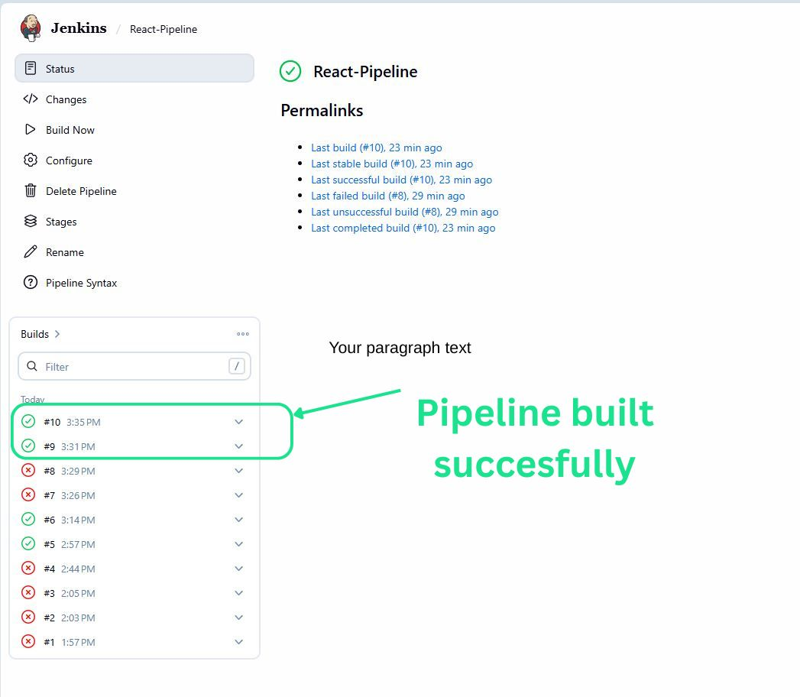

# Automated CI/CD Pipeline for React

## 1. Project Overview
This project demonstrates the implementation of a robust **Continuous Integration and Continuous Deployment (CI/CD)** pipeline for a React application. By leveraging Jenkins and Docker, I automated the build, testing, and deployment lifecycle, ensuring that code changes are delivered to the environment seamlessly.

## 2. Why I chose this project
I chose this project to bridge the gap between "writing code" and "delivering software." Building a React application is only half the battle; the real challenge is automating the deployment process. This project showcases my proficiency in:
* **DevOps Engineering:** Automating repetitive infrastructure tasks.
* **Infrastructure as Code (IaC):** Managing environments using `Dockerfile` and `Jenkinsfile`.
* **Containerization:** Using Docker to ensure application consistency across environments.

## 3. Architecture
The project follows a modern automated deployment flow:
* **Source:** GitHub (Version Control)
* **Automation:** Jenkins (CI/CD Server)
* **Runtime:** Docker (Containerized Infrastructure)
* **Workflow:** `git push` → Jenkins Automated Build → Docker Image Creation → Automated Deployment.

## 4. How I built it from scratch

### Step 1: Containerizing the Application
I utilized a **Multi-Stage Docker Build**. 
* **Stage 1 (Build):** Compiles the React source code into static assets.
* **Stage 2 (Serve):** Uses a lightweight Alpine image to serve the application, ensuring the final image is secure and optimized for production.

### Step 2: Configuring the CI/CD Pipeline
I implemented a `Jenkinsfile` (Pipeline-as-Code) to define the automation logic:
1. **Checkout:** Automatically pulls the latest code from the GitHub repository.
2. **Build:** Executes a Docker build to package the new code.
3. **Deploy:** Automatically stops the previous version of the app and spins up the new containerized version.

### Step 3: Bridging Docker & Jenkins
I enabled "Docker-outside-of-Docker" by mounting the host's Docker socket (`/var/run/docker.sock`) into the Jenkins container. This allows Jenkins to orchestrate Docker containers on the host machine.

## 5. Visual Documentation
*(Include your screenshots here in the following format)*

* **Pipeline Dashboard:** 
* **Build Logs:** 
* **Live App Update:** 
* **Architecture Diagram:** 

## 6. How to run this app
To replicate this CI/CD pipeline, follow these steps:

1. **Clone the Repository:**
   ```bash
   git clone [https://github.com/pitalsmith/react-app-pipeline.git](https://github.com/pitalsmith/react-app-pipeline.git)
   cd react-app-pipeline
